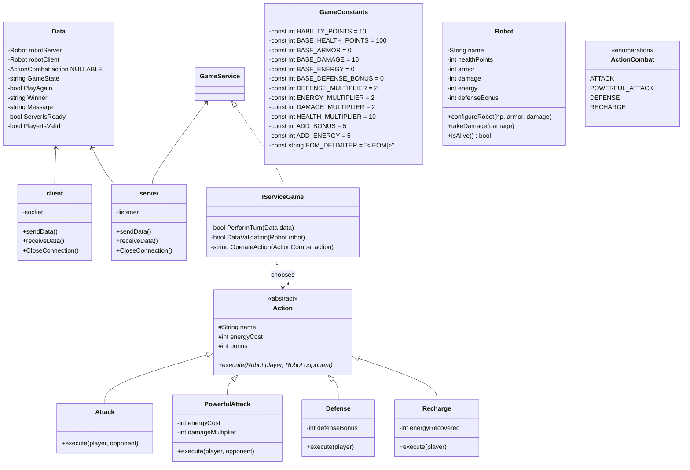
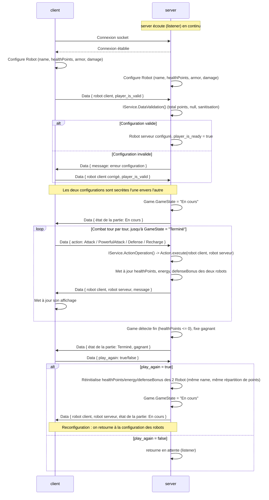
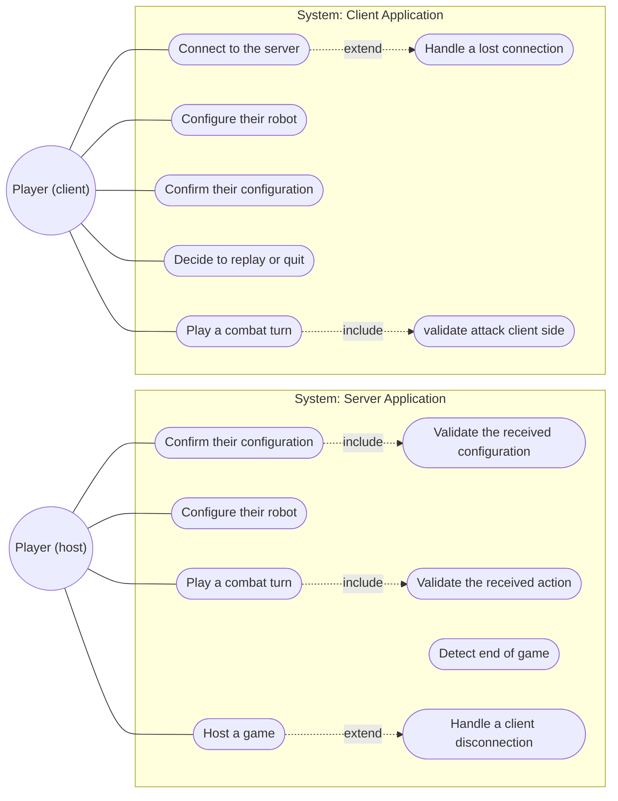

# CombatDeRobots_2630720

Application WPF pour maîtriser les sockets synchrones et la sérialisation/désérialisation de données dans le cadre du cours *Développement d'application Expert (420-E80-CH)*. L'application permet de se connecter à un autre joueur, de configurer un robot et de se battre en tour par tour.

## Description

L'application fonctionne autour des sockets synchrones. Le serveur est celui qui héberge et détient la vérité du jeu. Le client peut se connecter au serveur grâce à son IP et son port. Ensuite, chacun devra configurer son robot, et une fois la configuration validée de chaque côté, il y aura une étape de combat en tour par tour. La partie se termine quand la vie du robot d'un des deux joueurs atteint zéro, et finalement le client décidera si les deux rejouent la partie ou s'ils quittent.

## Fonctionnalités

- Le serveur peut se mettre en attente et attendre une connexion de la part d'un client
- Le client peut se connecter au serveur grâce à son IP et son port
- Les deux pourront faire leur configuration
- Ils se battront au tour par tour jusqu'à ce que l'un d'eux meure
- Un écran de fin sera affiché et le client pourra choisir de recommencer la partie ou de quitter le jeu

## Modèles de données

Les schémas ci-dessous représentent les interactions entre les classes, le déroulement de l'application et les cas d'utilisation présents dans l'application.

### Diagrammes de Classes



### Diagrammes de séquence



### Diagrammes de cas d'utilisation



## Structure du projet

```
CombatDeRobots_2630720/
├── Joueur_Client/
│   ├── Common/       # enumérable et constante
│   ├── Helpers/      # RelayCommand.cs
│   ├── Models/       
│   ├── Service/      # classes de services
│   ├── ViewModels/   
|   └── Views/        
├── Joueur_Server/
│   ├── Common/       # enumérable et constante
│   ├── Helpers/      # RelayCommand.cs
│   ├── Models/       
│   ├── Service/      # classes de services
│   ├── ViewModels/   
|   └── Views/ 
└── Joueur_Server.Test/
```

## Technologies

- C# / WPF
- XAML pour l'affichage
- Sockets synchrones

## Auteur

Projet réalisé en deux parties :
- Première partie : analyse réalisée en groupe
- Seconde partie : développement réalisé seul

Le tout dans le cadre du cours 420-E80-CH.
